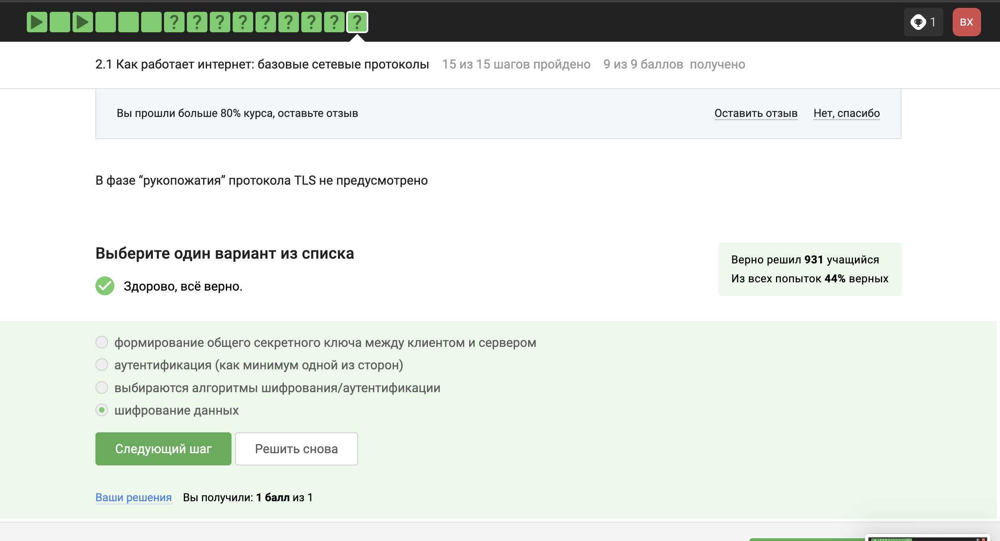
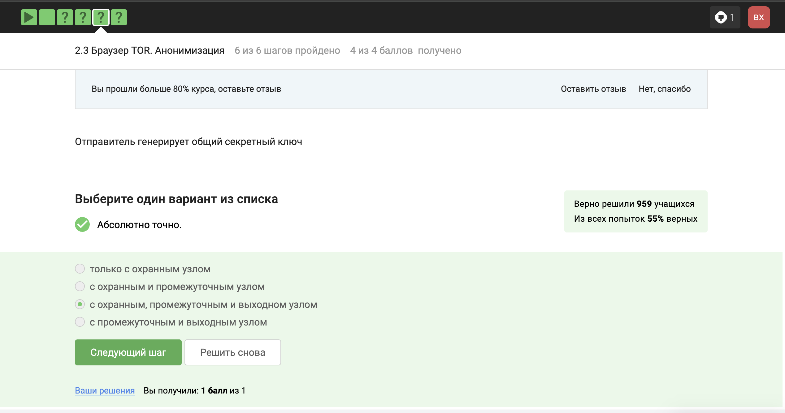
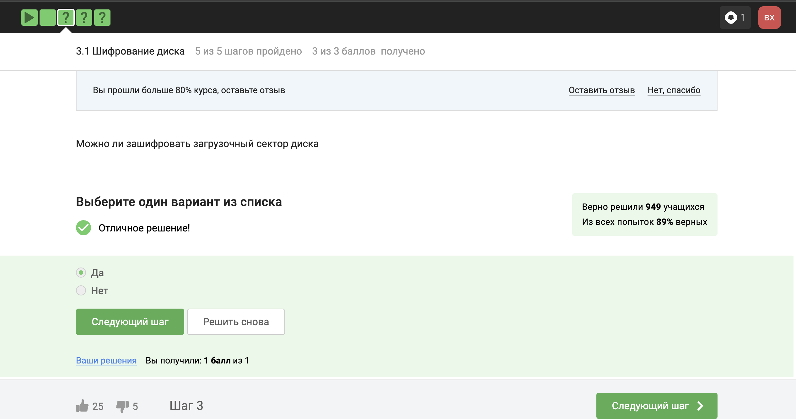
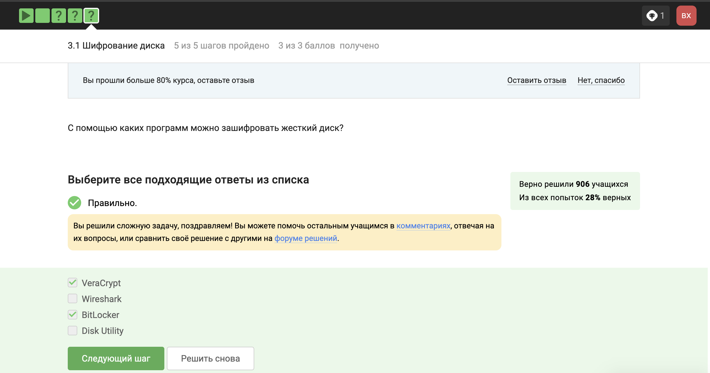
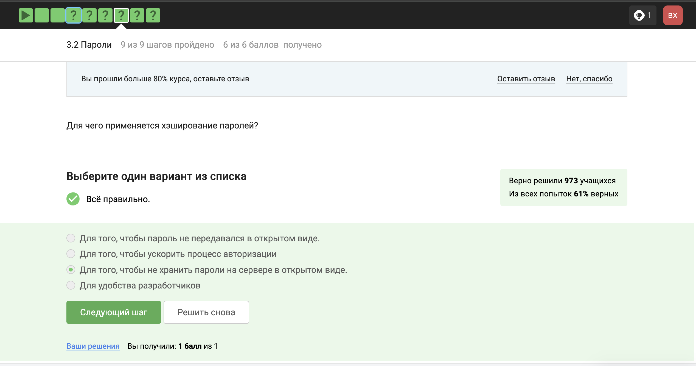

## Front matter
title: "Отчет по прохождению внешнего курса"
subtitle: "Основы Инфомационной безопасности"
author: "Хрусталев Влад Николаевич"

# Безопасность в сети

## Воспрос №1

HTTPS является протоколом прикладного уровня, так как он работает поверх транспортного протокола (обычно TCP) и предоставляет приложениям следующие возможности:
- **Шифрование**: HTTPS шифрует данные, передаваемые между клиентом и сервером, обеспечивая их конфиденциальность и безопасность.
- **Аутентификация**: HTTPS использует цифровые сертификаты для подтверждения подлинности сервера, что позволяет пользователям быть уверенными в том, что они подключаются к правильному веб-сайту.
- **Целостность данных**: HTTPS проверяет целостность передаваемых данных, чтобы убедиться, что они не были подделаны или изменены в процессе передачи.

Эти функции позволяют таким приложениям, как веб-браузеры и веб-серверы, безопасно и надежно обмениваться данными через Интернет.

{#fig:001 width=70%} 

## Воспрос №2

TCP работает на транспортном уровне, поскольку отвечает за передачу данных между приложениями на разных узлах сети. Он обеспечивает надежную доставку данных, управляя их сегментацией, сборкой и повторной передачей в случае потерь.

{#fig:002 width=70%} 

## Воспрос №3

Адреса 421.0.15.19 и 43.12.256.7 некорректны, потому что: 
421.0.15.19: Четвертый октет должен быть в диапазоне от 0 до 255. 43.12.256.7: Третий октет должен быть в диапазоне от 0 до 255. Корректный 

{#fig:003 width=70%} 

## Воспрос №4

DNS-сервер (система доменных имен) сопоставляет доменные имена с соответствующими IP-адресами. Это позволяет пользователям легко получить доступ к веб-сайтам и другим сетевым ресурсам, вводя понятные доменные имена вместо сложных числовых IP-адресов.

{#fig:004 width=70%} 

## Воспрос №5

Эта последовательность соответствует стеку протоколов TCP/IP, где:

Прикладной уровень: предоставляет услуги приложениям, таким как передача файлов (FTP), электронная почта (SMTP) и веб-просмотр (HTTP).
Транспортный уровень: обеспечивает надежную передачу данных между хостами, используя протоколы TCP и UDP.
Сетевой уровень: отвечает за адресацию и маршрутизацию данных, используя протокол IP.
Канальный уровень: управляет передачей данных по физическому сетевому интерфейсу, используя протоколы, такие как Ethernet и Wi-Fi.

{#fig:005 width=70%} 

## Воспрос №6

Протокол HTTP (Hypertext Transfer Protocol) не шифрует данные, передаваемые между клиентом и сервером. Для безопасной передачи данных используется HTTPS (HTTP Secure), который шифрует данные с помощью протоколов SSL/TLS

{#fig:006 width=70%} 

## Воспрос №7 

Протокол HTTPS состоит из двух основных фаз:

Фаза рукопожатия: Клиент и сервер договариваются об используемых криптографических алгоритмах и обмениваются цифровыми сертификатами для аутентификации.
Фаза передачи данных: После успешного рукопожатия данные шифруются с использованием согласованных алгоритмов и передаются между клиентом и сервером.

{#fig:007 width=70%} 

## Воспрос №8

Версия протокола TLS определяется в процессе "переговоров" между клиентом и сервером во время фазы рукопожатия. Клиент отправляет список поддерживаемых версий TLS, а сервер выбирает самую высокую общую версию, которую они оба поддерживают.

{#fig:008 width=70%} 

## Воспрос №9

В фазе "рукопожатия" протокола TLS не предусмотрено шифрование данных. Эта фаза используется для установления безопасного канала связи, включая:

Выбор версии протокола TLS и криптографических алгоритмов.
Аутентификацию клиента и/или сервера с использованием цифровых сертификатов.
Формирование общего секретного ключа.
После успешного рукопожатия данные шифруются и передаются во время фазы передачи данных.

{#fig:009 width=70%} 

## Воспрос №10

{#fig:010 width=70%} 

## Воспрос №11

{#fig:011 width=70%} 

## Воспрос №12

{#fig:012 width=70%} 

## Воспрос №13

{#fig:013 width=70%} 

## Воспрос №14

В луковой сети TOR используется три промежуточных узла для обеспечения анонимности и защиты от сетевого анализа. Эти узлы называются входным узлом, промежуточным узлом и выходным узлом.

{#fig:014 width=70%} 

## Воспрос №15

В луковой сети TOR отправитель и выходной узел знают IP-адрес получателя, поскольку отправитель отправляет данные непосредственно получателю через выходной узел. Охранный узел и промежуточный узел знают только IP-адрес следующего узла в цепочке, что обеспечивает анонимность.

{#fig:015 width=70%} 

## Воспрос №16

При использовании охранных, промежуточных и выходных узлов создается более надежная и защищенная система обмена ключами. Каждый узел выполняет определенные функции для обеспечения безопасности передаваемой информации. Охранный узел обеспечивает защиту от несанкционированного доступа, промежуточный узел может добавлять дополнительные слои защиты или обработки данных, а выходной узел отвечает за передачу уже защищенной информации получателю.

Использование всех трех узлов позволяет увеличить сложность системы шифрования и сделать её менее уязвимой к атакам. Кроме того, это позволяет более эффективно защищать информацию при передаче от отправителя к получателю.

{#fig:016 width=70%} 

## Воспрос №17

Получателю не нужно использовать браузер Tor или другой браузер, основанный на луковой маршрутизации, для успешного получения пакетов. Луковые маршрутизаторы автоматически расшифровывают и перенаправляют пакеты через цепочку луковых маршрутизаторов, обеспечивая анонимность отправителя, но не получателя.

{#fig:017 width=70%} 

## Воспрос №18

Wi-Fi (сокращение от Wireless Fidelity) — это технология беспроводной локальной сети (WLAN), которая использует радиоволны для предоставления сетевого доступа и подключения устройств в пределах ограниченной области действия. Она основана на стандартах Института инженеров по электротехнике и электронике (IEEE), в частности, IEEE 802.11, и позволяет устройствам подключаться к Интернету, обмениваться файлами и совместно использовать ресурсы без физических кабельных соединений.

{#fig:018 width=70%} 

## Воспрос №19

Протокол Wi-Fi работает на канальном уровне модели OSI. Канальный уровень отвечает за передачу данных между устройствами в пределах одного сегмента сети. Он управляет доступом к среде передачи, обнаруживает и исправляет ошибки в передаваемых данных и обеспечивает физическую адресацию устройств. В контексте Wi-Fi канальный уровень реализуется стандартами IEEE 802.11, такими как 802.11a, 802.11b, 802.11g, 802.11n и 802.11ac, которые определяют различные физические и протокольные характеристики для беспроводной связи.

{#fig:019 width=70%} 

## Воспрос №20

WEP (Wired Equivalent Privacy) является небезопасным методом обеспечения шифрования и аутентификации в сети Wi-Fi. Он был разработан в 1997 году как первый протокол безопасности для беспроводных локальных сетей, но из-за серьезных уязвимостей его безопасность была скомпрометирована вскоре после появления. WEP использует слабые механизмы шифрования и аутентификации, что делает его уязвимым для перехвата и взлома данных. Поэтому WEP больше не рекомендуется использовать и должен быть заменен более надежными протоколами безопасности, такими как WPA, WPA2 или WPA3.

{#fig:020 width=70%} 

## Воспрос №21

В современных сетях Wi-Fi данные между хостом сети (компьютером или смартфоном) и роутером передаются в зашифрованном виде после того, как устройства успешно пройдут аутентификацию. Это делается для защиты данных от перехвата и несанкционированного доступа. Для шифрования используются протоколы безопасности, такие как WPA2 или WPA3, которые обеспечивают надежное шифрование и аутентификацию.

{#fig:021 width=70%} 

## Воспрос №22

Для домашней сети для аутентификации обычно используется метод WPA2 Personal. WPA2 Personal использует предварительный общий ключ (PSK) для аутентификации устройств в сети. PSK — это пароль, который должен быть одинаковым на всех устройствах, подключающихся к сети. WPA2 Personal прост в настройке и обеспечивает надежную защиту для домашних сетей.

{#fig:022 width=70%} 

# Защита ПК/телефона

## Воспрос №23

Загрузочный сектор диска можно зашифровать с помощью специальных инструментов и методов. Шифрование загрузочного сектора добавляет дополнительный уровень безопасности, защищая данные на диске от несанкционированного доступа в случае кражи или потери устройства. Однако стоит отметить, что шифрование загрузочного сектора может усложнить процесс восстановления системы в случае сбоев.

{#fig:023 width=70%} 

## Воспрос №24

Шифрование диска обычно основано на симметричном шифровании. Симметричное шифрование использует один и тот же ключ как для шифрования, так и для расшифровки данных. Этот ключ должен храниться в секрете и защищаться от несанкционированного доступа. Симметричные алгоритмы шифрования, такие как AES (Advanced Encryption Standard), обеспечивают высокую степень защиты данных.

{#fig:024 width=70%} 

## Воспрос №25

VeraCrypt и Disk Utility — это программы, которые можно использовать для шифрования жесткого диска.

VeraCrypt — это бесплатное программное обеспечение с открытым исходным кодом, доступное для Windows, macOS и Linux.
Disk Utility — это встроенный инструмент в macOS, который можно использовать для шифрования дисков и создания образов дисков.

{#fig:025 width=70%} 

## Воспрос №26

Пароль UQr9@j4!S$ можно отнести к стойким, поскольку он соответствует следующим критериям:

Длина: Длина пароля не менее 12 символов.
Разнообразие символов: Пароль содержит как заглавные, так и строчные буквы, цифры и специальные символы.
Отсутствие распространенных слов или фраз: Пароль не содержит распространенных слов или фраз, которые легко угадать.
Отсутствие личной информации: Пароль не содержит личной информации, такой как имя, дата рождения или адрес.

{#fig:026 width=70%} 

## Воспрос №27

Менеджеры паролей — это самый безопасный способ хранения паролей. Они шифруют пароли и хранят их в защищенном хранилище, к которому можно получить доступ только с помощью мастер-пароля. Менеджеры паролей также могут генерировать надежные пароли и синхронизировать их на всех ваших устройствах.

{#fig:027 width=70%} 

## Воспрос №28

Капча — это метод защиты от автоматизированных атак, направленных на получение несанкционированного доступа. Она требует от пользователя выполнения задачи, которую трудно выполнить автоматически, например, ввести искаженный текст или решить простую математическую задачу. Это помогает отличить реальных пользователей от ботов и предотвратить автоматический ввод паролей и других данных учетной записи.

{#fig:028 width=70%} 

## Воспрос №29

Хэширование паролей используется для защиты паролей пользователей от несанкционированного доступа. Пароли хэшируются с использованием односторонней функции хэширования, и полученный хэш хранится на сервере вместо исходного пароля. Хэш не может быть обращен, поэтому даже если злоумышленник получит доступ к базе данных паролей, он не сможет восстановить исходные пароли.

{#fig:029 width=70%} 

## Воспрос №30

Если злоумышленнику удалось получить доступ к серверу и базе данных с хэшированными паролями, соль не поможет предотвратить атаку на пароли. В этом случае безопасность паролей будет зависеть от качества самого пароля (сложность, длина, отсутствие логической связи с личными данными и т.д.), а также защиты самого сервера и базы данных от несанкционированного доступа.

{#fig:030 width=70%} 

## Воспрос №31

Все варианты ответов правильные, потому что каждая мера вносит свой вклад в улучшение безопасности от атак перебором паролей:

Использование разных паролей на всех сайтах помогает предотвратить массовую утечку данных в случае компрометации одного из сервисов.
Периодическая смена паролей уменьшает вероятность успешной атаки перебором и увеличивает общую безопасность аккаунта.
Использование сложных и длинных паролей затрудняет процесс перебора паролей злоумышленниками, так как увеличивает количество возможных комбинаций.
Капча (тесты на человечность) может помочь предотвратить автоматизированные атаки перебором паролей, так как эти тесты могут усложнить автоматическую генерацию и отправку запросов.
Комбинация этих мер повышает уровень безопасности и защиты от атак перебором паролей.

{#fig:031 width=70%} 

## Воспрос №32

https://online.sberbank.wix.ru/CSAFront/index.do
https://passport.yandex.ucoz.ru/auth?origin=homedesktopru

Эти ссылки являются фишинговыми, потому что:

https://online.sberbank.wix.ru/CSAFront/index.do: это поддельный сайт Сбербанка, размещенный на платформе Wix.com. Сбербанк не использует Wix для своих официальных веб-сайтов.
https://passport.yandex.ucoz.ru/auth?origin=homedesktopru: это поддельный сайт Яндекса, размещенный на платформе uCoz.ru. Яндекс не использует uCoz для своих официальных веб-сайтов.

{#fig:032 width=70%} 

## Воспрос №33

Фишинговый имейл может прийти от знакомого адреса. Злоумышленники могут скомпрометировать электронные почтовые аккаунты или использовать техники спуфинга, чтобы подделать адрес отправителя, заставив его выглядеть так, как будто он отправлен от знакомого или доверенного источника.

{#fig:033 width=70%} 

## Воспрос №34

Email спуфинг — это техника, используемая злоумышленниками для подделки адреса отправителя в электронных письмах. Это позволяет им отправлять электронные письма, которые кажутся отправленными от законного источника, такого как банк, компания или друг, с целью обмана получателя и получения конфиденциальной информации или распространения вредоносного ПО.

{#fig:034 width=70%} 

## Воспрос №35

Вирус-троян маскируется под легитимную программу, чтобы обмануть пользователя и заставить его установить его на свой компьютер. После установки троян может выполнять различные вредоносные действия, такие как кража информации, модификация системы или загрузка и установка другого вредоносного ПО.

{#fig:035 width=70%} 

## Воспрос №36

Ключ шифрования в протоколе мессенджеров Signal формируется при генерации первого сообщения стороной-отправителем. Это происходит для обеспечения безопасности и конфиденциальности переписки с самого начала. Ключ шифрования используется для защиты сообщений и обмена данных между участниками чата. При каждом новом сообщении ключи не генерируются заново, так как это может повлиять на производительность и надежность шифрования.

{#fig:036 width=70%} 

## Воспрос №37

Суть сквозного шифрования заключается в том, что сообщения передаются по узлам связи (серверам) в зашифрованном виде. Это означает, что переданные данные остаются зашифрованными на протяжении всего пути передачи от отправителя к получателю. Таким образом, только получатель, обладающий правильным ключом для расшифровки, может прочитать сообщение. В данном случае серверы служат только для маршрутизации сообщений, но не могут прочитать их в открытом виде. Это обеспечивает повышенную безопасность и конфиденциальность передаваемых данных.

{#fig:037 width=70%} 

# Криптография на практике

## Воспрос №38

Это соответствует основному принципу асимметричной криптографии, где один ключ служит для шифрования данных, а другой для их расшифровки. Публичный ключ может быть опубликован и доступен для всех, в то время как приватный ключ остается в секрете у его обладателя. Это обеспечивает безопасную передачу данных и создание цифровых подписей для проверки подлинности.

{#fig:038 width=70%} 

## Воспрос №39

Криптографические хэш-функции обладают следующими свойствами:

Они отображают данные произвольной длины в битовую строку фиксированной длины.
Они устойчивы к коллизиям, что означает, что очень трудно найти два разных сообщения, которые имеют одинаковый хэш.
Они эффективно вычисляются, то есть для вычисления хэша любого данного сообщения требуется относительно небольшое количество времени и вычислительных ресурсов.

{#fig:039 width=70%} 

## Воспрос №40

Эти алгоритмы используются в различных приложениях, таких как электронная почта, электронная коммерция и электронные правительственные услуги.

{#fig:040 width=70%} 

## Воспрос №41

Коды аутентификации сообщений (MAC) относятся к симметричным примитивам. Они генерируются с использованием симметричного ключа и используются для проверки целостности данных. MAC обеспечивает целостность сообщения, гарантируя, что оно не было изменено после отправки.

{#fig:041 width=70%} 

## Воспрос №42

Обмен ключами Диффи-Хэллмана — это асимметричный примитив, используемый для генерации общего секретного ключа между двумя сторонами, которые не имеют общего секрета до начала процесса обмена ключами. Он позволяет двум сторонам установить общий секретный ключ через незащищенный канал связи без передачи самого секретного ключа.

{#fig:042 width=70%} 

## Воспрос №43

Протоколы электронной цифровой подписи относятся к протоколам с публичным (или открытым) ключом. В этих протоколах отправитель подписывает сообщение с использованием своего закрытого ключа, а получатель может проверить подпись с помощью открытого ключа отправителя.

{#fig:043 width=70%} 

## Воспрос №44

Алгоритм верификации электронной цифровой подписи требует на вход подпись, открытый ключ и сообщение. Он проверяет, что подпись была создана с использованием соответствующего закрытого ключа и что сообщение не было изменено после подписания.

{#fig:044 width=70%} 

## Воспрос №45

Электронная цифровая подпись не обеспечивает конфиденциальность. Она обеспечивает аутентификацию, неотказ от авторства и целостность, но не шифрует сообщение. Для обеспечения конфиденциальности необходимо использовать алгоритм шифрования.

{#fig:045 width=70%} 

## Воспрос №46

Для отправки налоговой отчетности в ФНС потребуется сертификат электронной подписи типа усиленная квалифицированная.

{#fig:046 width=70%} 

## Воспрос №47

Квалифицированный сертификат ключа проверки электронной подписи можно получить в удостоверяющем (сертификационном) центре, имеющем соответствующую лицензию ФСБ.

{#fig:047 width=70%} 

## Воспрос №48

Платежные системы: MasterCard, МИР. Все они позволяют осуществлять денежные переводы и расчеты.

{#fig:048 width=70%} 

## Воспрос №49

Многофакторная аутентификация требует предоставления двух или более факторов аутентификации.

{#fig:049 width=70%} 

## Воспрос №50

Многофакторная аутентификация стала стандартом безопасности при онлайн платежах, так как она обеспечивает более высокий уровень защиты. В этом случае покупатель должен пройти процедуру проверки, предоставив не только что-то, что он знает (например, пароль), но и что-то, что он имеет (например, код, полученный на телефон) и что-то, что он является (например, отпечаток пальца). Это усложняет задачу злоумышленникам, улучшая общую безопасность онлайн транзакций. Другие варианты включают в себя менее надежные формы аутентификации, такие как однофакторная аутентификация или использование только PIN-кода карты, что может быть уязвимо к различным видам мошенничества.

{#fig:050 width=70%} 

## Воспрос №51

Свойство криптографической хэш-функции, которое используется в доказательстве работы (proof of work), это сложность нахождения прообраза. Это связано с тем, что при выполнении доказательства работы (например, в майнинге криптовалют) участник должен провести определенное количество вычислений, чтобы найти значение хэш-функции, которое удовлетворяет определенным условиям (например, начинается с определенного количества нулей). Таким образом, сложность нахождения прообраза является ключевым элементом доказательства работы.

Свойство криптографической хэш-функции, которое используется в доказательстве работы (proof of work), это сложность нахождения прообраза. Это связано с тем, что при выполнении доказательства работы (например, в майнинге криптовалют) участник должен провести определенное количество вычислений, чтобы найти значение хэш-функции, которое удовлетворяет определенным условиям (например, начинается с определенного количества нулей). Таким образом, сложность нахождения прообраза является ключевым элементом доказательства работы.

{#fig:051 width=70%} 

## Воспрос №52

Все эти свойства могут быть характерны для консенсуса в некоторых системах блокчейн:

Постоянство: Консенсус в системах блокчейн обычно обеспечивает постоянство работоспособности и корректности данных, так как он позволяет участникам согласовывать состояние распределенного реестра.
Открытость: Консенсус обычно является открытым процессом, который позволяет участникам вносить свой вклад в формирование консенсуса и проверять правильность работы системы.
Живучесть: Консенсус в блокчейн-системах может быть устойчивым к различным атакам и сбоям, обеспечивая высокую степень живучести системы.
Таким образом, все три свойства — постоянство, открытость и живучесть — могут быть присущи консенсусу в некоторых системах блокчейн.

{#fig:052 width=70%} 

## Воспрос №53

Участники блокчейна хранят секретные ключи для использования в цифровой подписи. Цифровая подпись в криптографии используется для подтверждения авторства сообщения или транзакции, а также для обеспечения целостности данных. Именно с помощью секретных ключей участники могут создавать и проверять цифровые подписи, что позволяет им безопасно совершать транзакции и обмениваться информацией в системе блокчейн. Таким образом, хранение секретных ключей для цифровой подписи является важным аспектом безопасности и передачи данных в блокчейне.

{#fig:053 width=70%} 

# Сертификата на курсе нет, поэтому баллы

Подверждение прохождения курса

{#fig:054 width=70%} 
