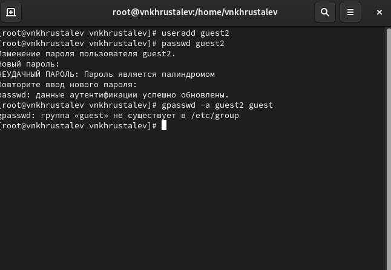
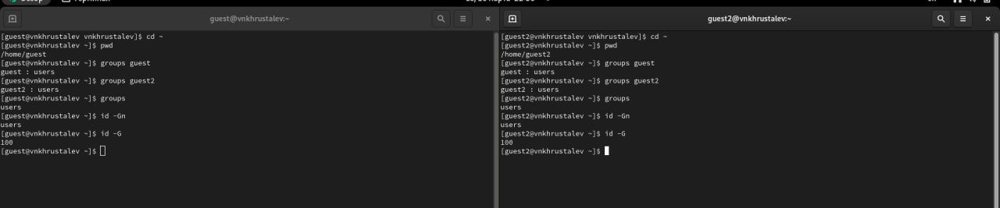
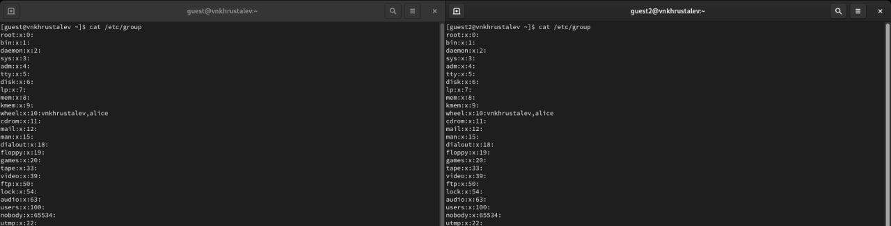
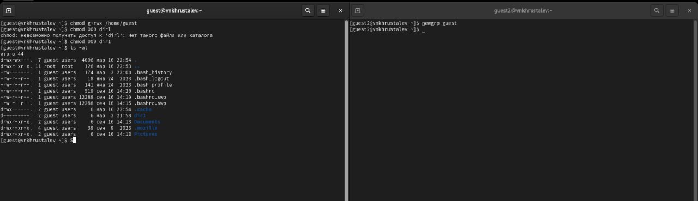

---
## Front matter
lang: ru-RU
title: Дискреционное разграничение прав в Linux. Основные атрибуты
author: |
	 Хрусталев Влад

institute: |
	\inst{1}Российский Университет Дружбы Народов

date: 16 марта, 2023, Москва, Россия

## Formatting
mainfont: PT Serif
romanfont: PT Serif
sansfont: PT Sans
monofont: PT Mono
toc: false
slide_level: 2
theme: metropolis
header-includes: 
 - \metroset{progressbar=frametitle,sectionpage=progressbar,numbering=fraction}
 - '\makeatletter'
 - '\beamer@ignorenonframefalse'
 - '\makeatother'
aspectratio: 43
section-titles: true

---

# Цели и задачи работы

## Цель лабораторной работы

Получение практических навыков работы в консоли с атрибутами файлов для групп пользователей.

# Процесс выполнения лабораторной работы

## Создадим второго пользователя guest2.
 
{ #fig:001 width=70% height=70% }

## Определение группы

{ #fig:002 width=70% height=70% }

## Сравнение с cat

{ #fig:003 width=70% height=70% }

## Управление правами группы

{ #fig:004 width=70% height=70%}

# Выводы по проделанной работе

## Вывод

В ходе выполнения работы, мы смогли приобрести практические навыки работы в консоли с атрибутами файлов для групп пользователей.