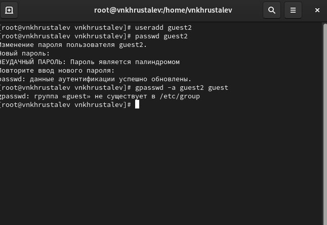

---
# Front matter
title: "Отчёт по лабораторной работе №3"
subtitle: "Дискреционное разграничение прав в Linux. Два пользователя"
author: "Хрусталев Влад Николаевич"

# Generic otions
lang: ru-RU
toc-title: "Содержание"

# Bibliography
bibliography: bib/cite.bib
csl: pandoc/csl/gost-r-7-0-5-2008-numeric.csl

# Pdf output format
toc: true # Table of contents
toc_depth: 2
lof: true # List of figures
lot: true # List of tables
fontsize: 12pt
linestretch: 1.5
papersize: a4
documentclass: scrreprt
## I18n
polyglossia-lang:
  name: russian
  options:
	- spelling=modern
	- babelshorthands=true
polyglossia-otherlangs:
  name: english
### Fonts
mainfont: PT Serif
romanfont: PT Serif
sansfont: PT Sans
monofont: PT Mono
mainfontoptions: Ligatures=TeX
romanfontoptions: Ligatures=TeX
sansfontoptions: Ligatures=TeX,Scale=MatchLowercase
monofontoptions: Scale=MatchLowercase,Scale=0.9
## Biblatex
biblatex: true
biblio-style: "gost-numeric"
biblatexoptions:
  - parentracker=true
  - backend=biber
  - hyperref=auto
  - language=auto
  - autolang=other*
  - citestyle=gost-numeric
## Misc options
indent: true
header-includes:
  - \linepenalty=10 # the penalty added to the badness of each line within a paragraph (no associated penalty node) Increasing the value makes tex try to have fewer lines in the paragraph.
  - \interlinepenalty=0 # value of the penalty (node) added after each line of a paragraph.
  - \hyphenpenalty=50 # the penalty for line breaking at an automatically inserted hyphen
  - \exhyphenpenalty=50 # the penalty for line breaking at an explicit hyphen
  - \binoppenalty=700 # the penalty for breaking a line at a binary operator
  - \relpenalty=500 # the penalty for breaking a line at a relation
  - \clubpenalty=150 # extra penalty for breaking after first line of a paragraph
  - \widowpenalty=150 # extra penalty for breaking before last line of a paragraph
  - \displaywidowpenalty=50 # extra penalty for breaking before last line before a display math
  - \brokenpenalty=100 # extra penalty for page breaking after a hyphenated line
  - \predisplaypenalty=10000 # penalty for breaking before a display
  - \postdisplaypenalty=0 # penalty for breaking after a display
  - \floatingpenalty = 20000 # penalty for splitting an insertion (can only be split footnote in standard LaTeX)
  - \raggedbottom # or \flushbottom
  - \usepackage{float} # keep figures where there are in the text
  - \floatplacement{figure}{H} # keep figures where there are in the text
---

# Цель работы

- Получение практических навыков работы в консоли с атрибутами файлов для групп пользователей

# Выполнение лабораторной работы

Создадим второго пользователя guest2. (рис. [-@fig:001])
Добавим пользователя guest2 в группу guest: gpasswd -a guest2 guest

{ #fig:001 width=70% height=70% }

Осуществим вход в систему от двух пользователей на двух разных консолях: guest на первой консоли и guest2 на второй консоли.
Для обоих пользователей командой pwd определим директорию, в которой вы находитесь. Сравните её с приглашениями командной строки.
Уточним имя вашего пользователя, его группу, кто входит в неё и к каким группам принадлежит он сам. Определите командами groups guest и groups guest2, в какие группы входят пользователи guest и guest2. Сравните вывод команды groups с выводом команд id -Gn и id -G.(рис. [-@fig:002])

{#fig:002 width=90%}

Просмотрим файл командой cat /etc/group (рис. [-@fig:003])

{ #fig:003 width=70% height=70% }

От имени пользователя guest2 выполним регистрацию пользователя guest2 в группе guest командой newgrp guest
От имени пользователя guest изменим права директории /home/guest, разрешив все действия для пользователей группы: chmod g+rwx /home/guest
От имени пользователя guest снимем с директории /home/guest/dir1 все атрибуты командой chmod 000 dirl и проверьте правильность снятия атрибутов.(рис. [-@fig:004])

{ #fig:004 width=70% height=70% }

Меняя атрибуты у директории dir1 и файла file1 от имени пользователя guest и делая проверку от пользователя guest2, заполним табл. 1, определив опытным путём, какие операции разрешены, а какие нет. Если операция разрешена, занесите в таблицу знак «+», если не разрешена, знак «-» [-@tbl:1]

: {#tbl:1} 

| Права файла и директории | Создание файла | Удаление файла | Запись в файл | Чтение файла | Смена директории | Просмотр файлов в директории | Переименование файла | Смена атрибутов файла |
|--------------------------|----------------|----------------|---------------|--------------|------------------|------------------------------|----------------------|-----------------------|
| 000                      | -              | -              | -             | -            | +                | -                            | -                    | +                     |
| 200                      | -              | -              | -             | -            | -                | -                            | -                    | -                     |
| 300                      | +              | -              | +             | -            | +                | -                            | +                    | +                     |
| 400                      | -              | -              | -             | -            | -                | +                            | -                    | -                     |
| 500                      | -              | -              | -             | +            | +                | +                            | -                    | +                     |
| 600                      | -              | -              | -             | -            | +                | +                            | -                    | -                     |
| 700                      | +              | +              | +             | +            | +                | +                            | +                    | +                     |

Исходя из таблиц выше и лабораторной 2, определим минимально необходимые права для совершения операций, заполним таблицу [-@tbl:2]

: Минимальные права для совершения операций {#tbl:2} 

| Операция               | Минимальные права на директорию | Минимальные права на файл |
|------------------------|---------------------------------|---------------------------|
| Создание файла         | 300                             | 200                       |
| Удаление файла         | 300                             | 200                       |
| Чтение файла           | 500                             | 400                       |
| Запись в файл          | 300                             | 200                       |
| Переименование файла   | 300                             | 200                       |
| Создание поддиректории | 300                             | 300                       |
| Удаление поддиректории | 300                             | 300                       |

# Выводы

В ходе выполнения работы мы получили практические навыки работы в консоли с атрибутами файлов.