---
## Front matter
lang: ru-RU
title: Презентация к лабораторной работе 5
subtitle: Основы информационной безопасности
author:
	Хрусталев Влад Николаевич
institute:
  - Российский университет дружбы народов им. Патриса Лумумбы, Москва, Россия

## i18n babel
babel-lang: russian
babel-otherlangs: english

## Formatting pdf
toc: false
toc-title: Содержание
slide_level: 2
aspectratio: 169
section-titles: true
theme: metropolis
header-includes:
 - \metroset{progressbar=frametitle,sectionpage=progressbar,numbering=fraction}
 - '\makeatletter'
 - '\beamer@ignorenonframefalse'
 - '\makeatother'

## Fonts
mainfont: Arial
romanfont: Arial
sansfont: Arial
monofont: Arial
---

## Цель работы

Изучение механизмов изменения идентификаторов, применения SetUID- и Sticky-битов. Получение практических навыков работы в консоли с дополнительными атрибутами. Рассмотрение работы механизма смены идентификатора процессов пользователей, а также влияние бита Sticky на запись и удаление файлов

## Создание файла simpleid.c

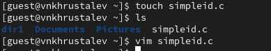{ #fig:002 width=70% }

## Создание(содержание) файла simpleid.c

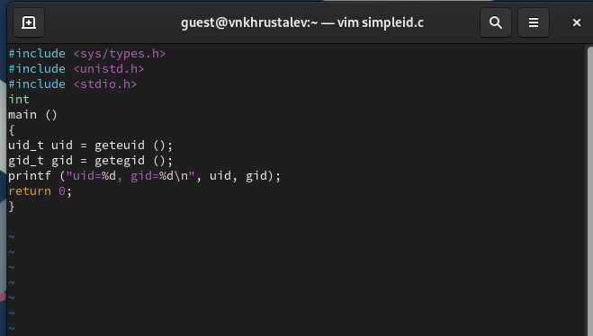{ #fig:001 width=70% }

## Компилирование программы simpleid.c и сравнение её работы с командой id

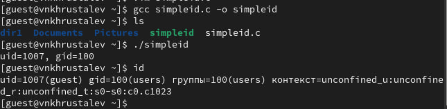{ #fig:003 width=70% }

## Создание(содержание) файла simpleid2.c

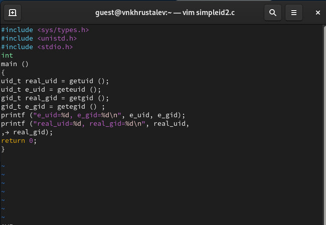{ #fig:004 width=70% }

## Компилирование программы simpleid2.c и запуск

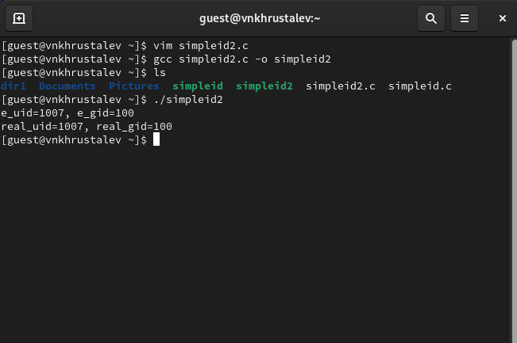{ #fig:005 width=70% }

## Изменение прав и владельца simpleid2

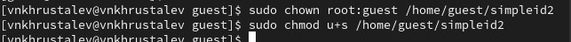{ #fig:006 width=70% }

## Проверка прав у simpleid2 + сравнение вывода программы с командой id

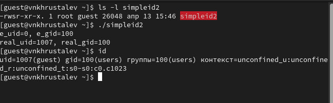{ #fig:007 width=70% }

## Создание(содержание) файла readfile.c

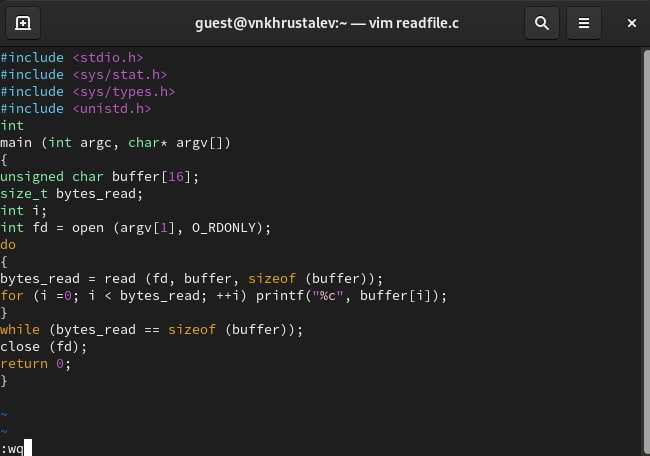{ #fig:008 width=70% }

## Измененение владельца и изменение прав доступа к файлу readfile.c

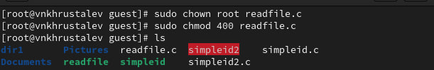{ #fig:009 width=70% }

## Попытка чтения файла readfile.c от стороннего пользователя

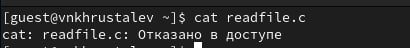{ #fig:010 width=70% }

## Изменение прав доступа к файлу readfile(u+s)

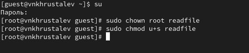{ #fig:011 width=70% }

## Попытка чтения фалйа readfile.c через программу readfile

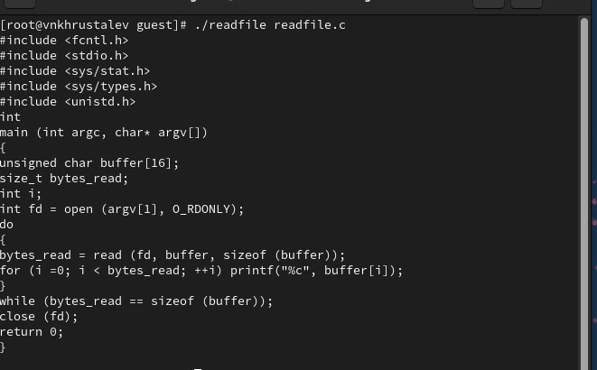{ #fig:012 width=70% }

## Попытка чтения фалйа /etc/shadow через программу readfile

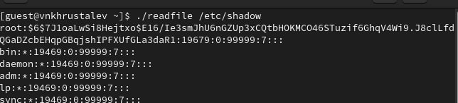{ #fig:013 width=70% }

## Создание файла /tmp/file.01 и измененее прав от имени пользователя guest

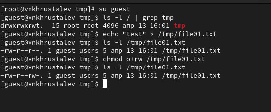{ #fig:014 width=70% }

## Попытка дописать(изменить) содержание файла /tmp/file.01 от другого пользователя

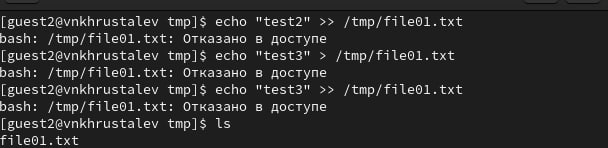{ #fig:015 width=70% }

## Попытка удалить файл /tmp/file.01 от другого пользователя

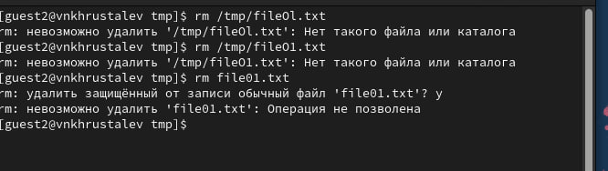{ #fig:016 width=70% }

## Изменение(удаление) Sticky бита папки /tmp и повторные попыкти предыдущих манипуляций

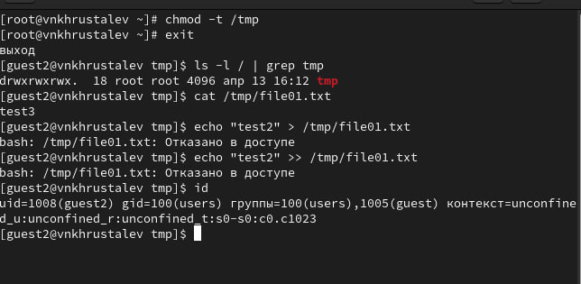{ #fig:017 width=70% }

## Возврат Sticky бита папки /tmp на место

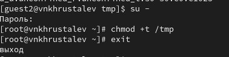{ #fig:018 width=70% }

# Выводы

Изучение механизмов изменения идентификаторов, применения SetUID- и Sticky-битов, а также получение практических навыков работы в консоли с дополнительными атрибутами позволяют глубже понять принципы безопасности и управления доступом в Unix-подобных системах. Рассмотрение работы механизма смены идентификатора процессов пользователей и влияние бита Sticky на запись и удаление файлов демонстрирует важность этих аспектов для обеспечения безопасности и контроля доступа в многопользовательских средах.