---
## Front matter
title: "Отчет по лабораторной работе 5"
subtitle: "Дисциплина: Информационная безопасность"
author: "Хрусталев Влад Николаевич"

## Generic otions
lang: ru-RU
toc-title: "Содержание"

## Bibliography
bibliography: bib/cite.bib
csl: pandoc/csl/gost-r-7-0-5-2008-numeric.csl

## Pdf output format
toc: true # Table of contents
toc-depth: 2
lof: true # List of figures
lot: true # List of tables
fontsize: 12pt
linestretch: 1.5
papersize: a4
documentclass: scrreprt
## I18n polyglossia
polyglossia-lang:
  name: russian
  options:
	- spelling=modern
	- babelshorthands=true
polyglossia-otherlangs:
  name: english
## I18n babel
babel-lang: russian
babel-otherlangs: english
## Fonts
mainfont: PT Serif
romanfont: PT Serif
sansfont: PT Sans
monofont: PT Mono
mainfontoptions: Ligatures=TeX
romanfontoptions: Ligatures=TeX
sansfontoptions: Ligatures=TeX,Scale=MatchLowercase
monofontoptions: Scale=MatchLowercase,Scale=0.9
## Biblatex
biblatex: true
biblio-style: "gost-numeric"
biblatexoptions:
  - parentracker=true
  - backend=biber
  - hyperref=auto
  - language=auto
  - autolang=other*
  - citestyle=gost-numeric
## Pandoc-crossref LaTeX customization
figureTitle: "Рис."
tableTitle: "Таблица"
listingTitle: "Листинг"
lofTitle: "Список иллюстраций"
lotTitle: "Список таблиц"
lolTitle: "Листинги"
## Misc options
indent: true
header-includes:
  - \usepackage{indentfirst}
  - \usepackage{float} # keep figures where there are in the text
  - \floatplacement{figure}{H} # keep figures where there are in the text
---

# Цель работы

Изучение механизмов изменения идентификаторов, применения SetUID- и Sticky-битов. Получение практических навыков работы в консоли с дополнительными атрибутами. Рассмотрение работы механизма смены идентификатора процессов пользователей, а также влияние бита Sticky на запись и удаление файлов

# Выполнение лабораторной работы

1. Создадим файл simpleid.c и введём в него программу(рис. [-@fig:001] и [-@fig:002])
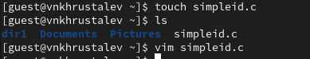{ #fig:002 width=70% }
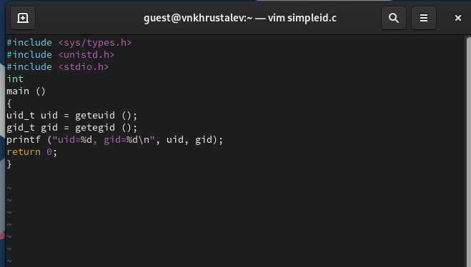{ #fig:001 width=70% }

2. Сохраним программу и сравним её работу с командой id. Как мы видим вывод верный(рис. [-@fig:003])
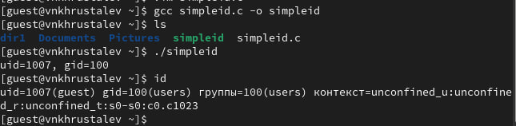{ #fig:003 width=70% }

3. Создадим файл simpleid2.c и введём в него программу, далее скомпилируем и запустим(рис. [-@fig:004] и [-@fig:005])
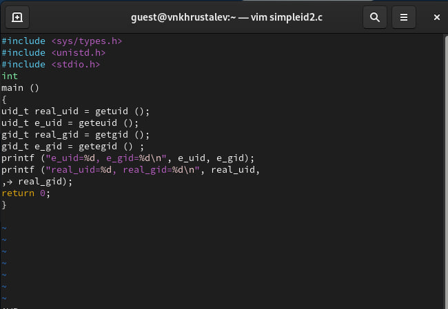{ #fig:004 width=70% }
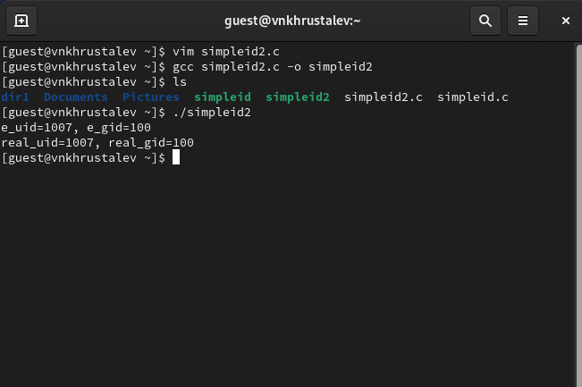{ #fig:005 width=70% }

4. Изменим права доступа к файлу simpleid2, так и владельца на root. После чего запустим программу и убедимся, что вывод схож с командой id.(рис. [-@fig:006] и [-@fig:007])
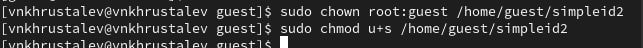{ #fig:006 width=70% }
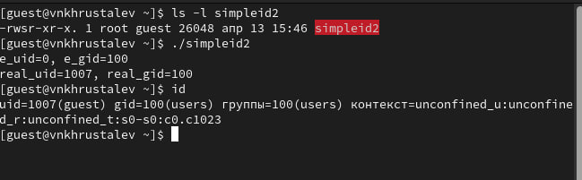{ #fig:007 width=70% }

5. Создадим файл readfile.c и введём в него программу. Далее изменим владельца на root и изменим права доступа так, чтобы доступ к файлу был только у root.(рис. [-@fig:008] и [-@fig:009])
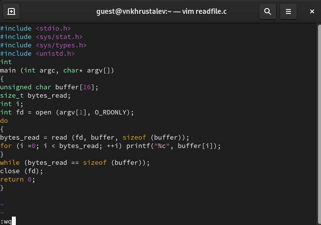{ #fig:008 width=70% }
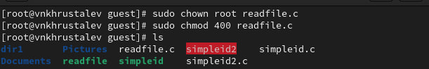{ #fig:009 width=70% }

6. Попытаемся прочитать файл readfile.c от другого пользователя. У нас это не выйдет.(рис. [-@fig:010])
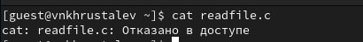{ #fig:010 width=70% }

7. Добавим бит к файлу readfile и попытаемся из него прочитать файлы, к которым у нас нет доступа. Как видим, всё выполняется, т.к. мы установили SetUID-бит.(рис. [-@fig:011] и [-@fig:012] и [-@fig:013])
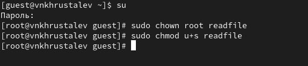{ #fig:011 width=70% }
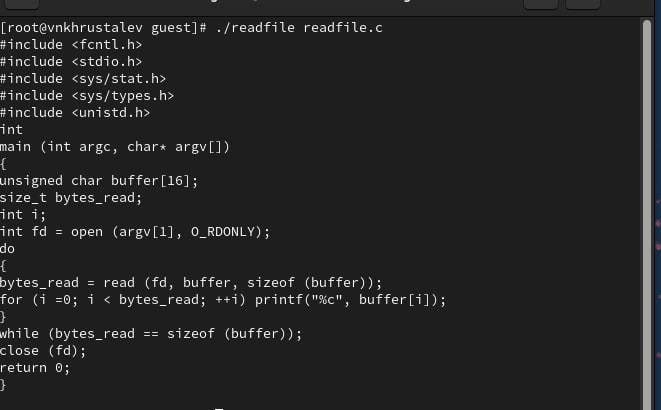{ #fig:012 width=70% }
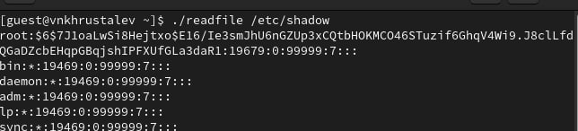{ #fig:013 width=70% }

8. Приступаеп к следующей части работы. Создадим файл /tmp/file.01 от имени пользователя guest, изменим права, выдав доступ к чтению и записи группе OTHER.(рис. [-@fig:014])
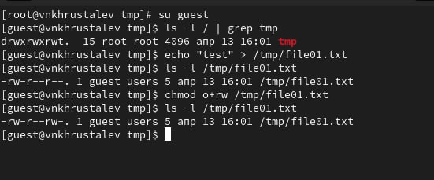{ #fig:014 width=70% }

9. Попытаемся дописать этот файл, изменить полностью файл, удалить файл от пользователя guest2. У нас ничего этого не выйдет, т.к. guest2 в группе users, как и guest, а группе мы права не выдавали.(рис. [-@fig:015] и [-@fig:016])
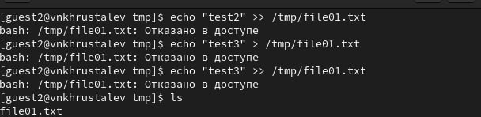{ #fig:015 width=70% }
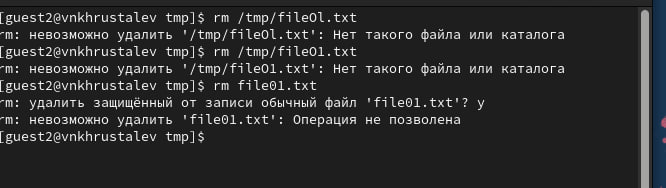{ #fig:016 width=70% }

9. Измененим(удалим) Sticky бит папки /tmp и повторно попытаемся выполнить предыдущик манипуляци. Опять же ничего не выйдет, по той же причине. После всех наших манипуляций, вернём Sticky бит для папки /tmp. (рис. [-@fig:017] и [-@fig:018])
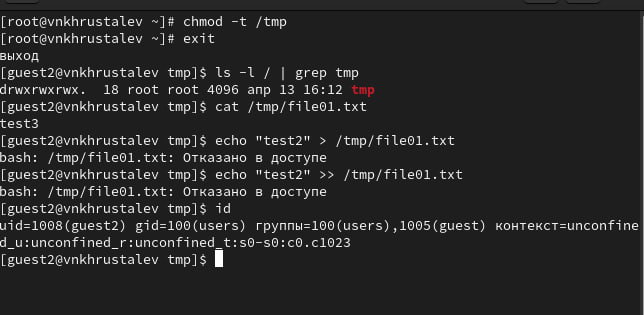{ #fig:017 width=70% }
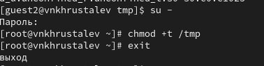{ #fig:018 width=70% }

# Выводы

Изучение механизмов изменения идентификаторов, применения SetUID- и Sticky-битов, а также получение практических навыков работы в консоли с дополнительными атрибутами позволяют глубже понять принципы безопасности и управления доступом в Unix-подобных системах. Рассмотрение работы механизма смены идентификатора процессов пользователей и влияние бита Sticky на запись и удаление файлов демонстрирует важность этих аспектов для обеспечения безопасности и контроля доступа в многопользовательских средах.