---
## Front matter
lang: ru-RU
title: Презентация к лабораторной работе 6
subtitle: Основы информационной безопасности
author:
	Хрусталев Влад Николаевич
institute:
  - Российский университет дружбы народов им. Патриса Лумумбы, Москва, Россия

## i18n babel
babel-lang: russian
babel-otherlangs: english

## Formatting pdf
toc: false
toc-title: Содержание
slide_level: 2
aspectratio: 169
section-titles: true
theme: metropolis
header-includes:
 - \metroset{progressbar=frametitle,sectionpage=progressbar,numbering=fraction}
 - '\makeatletter'
 - '\beamer@ignorenonframefalse'
 - '\makeatother'

## Fonts
mainfont: Arial
romanfont: Arial
sansfont: Arial
monofont: Arial
---

## Цель работы

Развить навыки администрирования ОС Linux. Получить первое практическое знакомство с технологией SELinux. Проверить работу SELinx на практике совместно с веб-сервером Apache.

## Сделаем подготовительные операции перед работой 

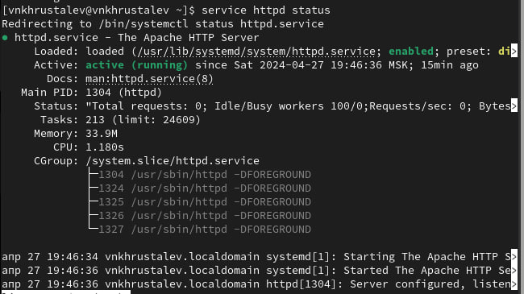{ #fig:002 width=70% }

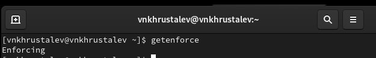{ #fig:001 width=70% }

## Определение контекста безопасности и попытка проверки наличия команды StInfo. +sestatus команды не существтует.

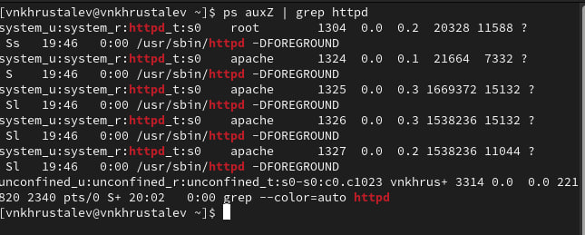{ #fig:003 width=70% }

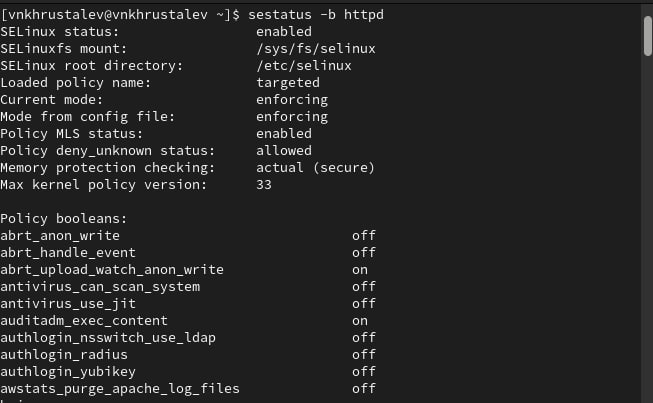{ #fig:004 width=70% }

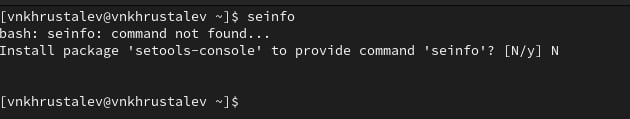{ #fig:005 width=70% }

## Определение типов файлов в диреекториях Apache (файлов серервера)

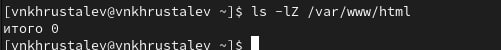{ #fig:006 width=70% }

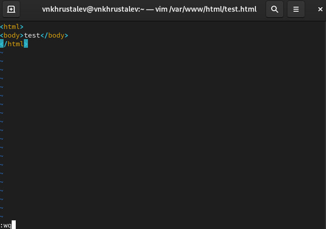{ #fig:007 width=70% }

## Создание html файла, проверка его контекста и визуальный просмотр

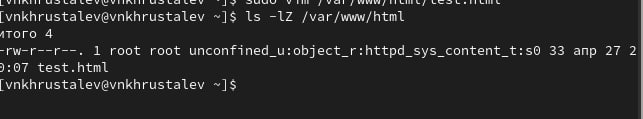{ #fig:008 width=70% }

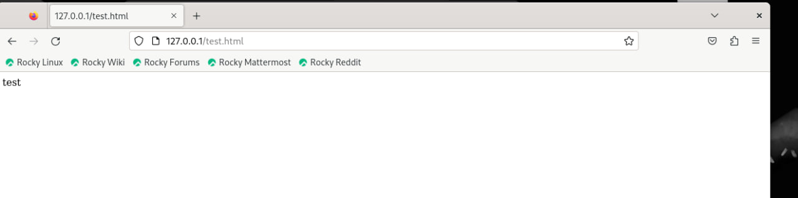{ #fig:009 width=70% }

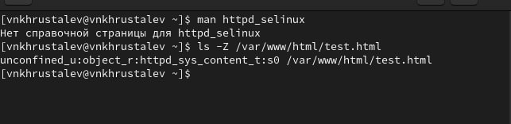{ #fig:010 width=70% }

## Просмотр инфо о команде httpd_selinux -- она отсутвует

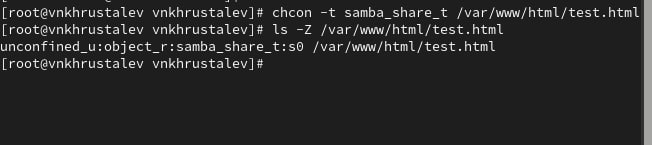{ #fig:011 width=70% }

## Изменение конктекста html файла на любой другой и попытка просмотра. У нес нет доступа. Так же проверим логи.

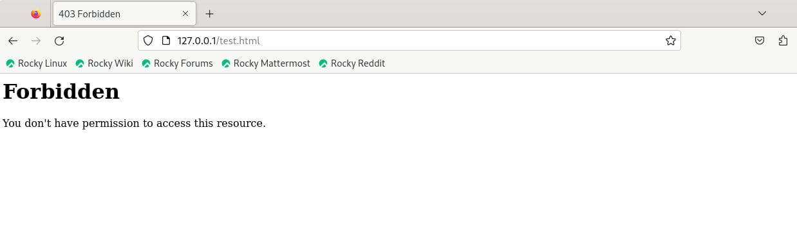{ #fig:012 width=70% }

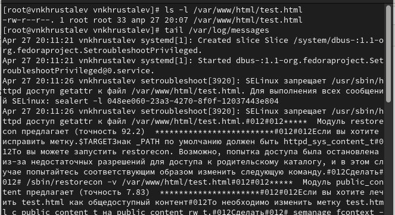{ #fig:013 width=70% }

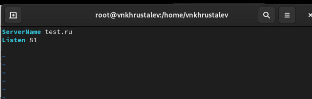{ #fig:014 width=70% }

## Проведём доп изменения. Изменим прослушиваемый порт сервреа на 81 и перезапустим веб-сервер. Ошибок у нас нет, так как я ранее пользовался тут Apache и порт 81 прописал в разрешённые. Поэтому команда добавления в разрешённые тут была излишняя

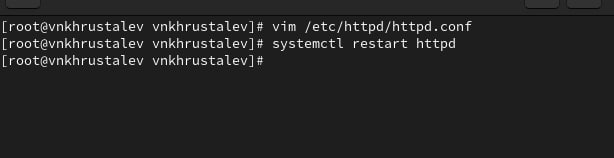{ #fig:015 width=70% }

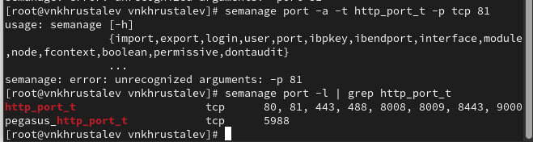{ #fig:016 width=70% }

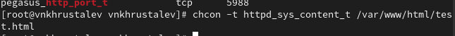{ #fig:017 width=70% }

## Вернём всё обратно. Проверим что всё отображается. И попытаемся отключить порт 81, но не выйдет так как он уже используется и прописан в другом месте 

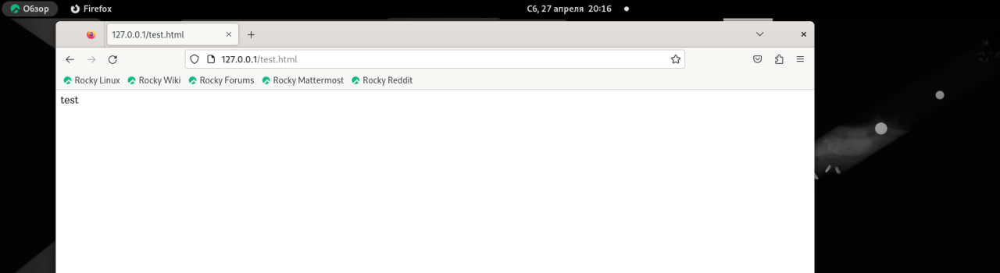{ #fig:018 width=70% }

{ #fig:021 width=70% }

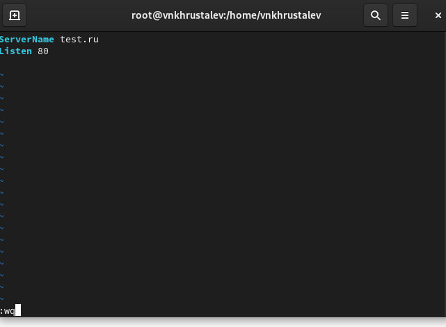{ #fig:019 width=70% }

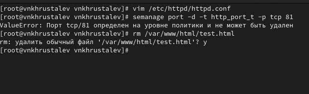{ #fig:020 width=70% }

# Выводы

На данной лабораторной работе мы развили навыки администрирования ОС Linux, получили первое практическое знакомство с технологией SELinux.
