---
## Front matter
title: "Отчет по лабораторной работе 6"
subtitle: "Дисциплина: Информационная безопасность"
author: "Хрусталев Влад Николаевич"

## Generic otions
lang: ru-RU
toc-title: "Содержание"

## Bibliography
bibliography: bib/cite.bib
csl: pandoc/csl/gost-r-7-0-5-2008-numeric.csl

## Pdf output format
toc: true # Table of contents
toc-depth: 2
lof: true # List of figures
lot: true # List of tables
fontsize: 12pt
linestretch: 1.5
papersize: a4
documentclass: scrreprt
## I18n polyglossia
polyglossia-lang:
  name: russian
  options:
	- spelling=modern
	- babelshorthands=true
polyglossia-otherlangs:
  name: english
## I18n babel
babel-lang: russian
babel-otherlangs: english
## Fonts
mainfont: PT Serif
romanfont: PT Serif
sansfont: PT Sans
monofont: PT Mono
mainfontoptions: Ligatures=TeX
romanfontoptions: Ligatures=TeX
sansfontoptions: Ligatures=TeX,Scale=MatchLowercase
monofontoptions: Scale=MatchLowercase,Scale=0.9
## Biblatex
biblatex: true
biblio-style: "gost-numeric"
biblatexoptions:
  - parentracker=true
  - backend=biber
  - hyperref=auto
  - language=auto
  - autolang=other*
  - citestyle=gost-numeric
## Pandoc-crossref LaTeX customization
figureTitle: "Рис."
tableTitle: "Таблица"
listingTitle: "Листинг"
lofTitle: "Список иллюстраций"
lotTitle: "Список таблиц"
lolTitle: "Листинги"
## Misc options
indent: true
header-includes:
  - \usepackage{indentfirst}
  - \usepackage{float} # keep figures where there are in the text
  - \floatplacement{figure}{H} # keep figures where there are in the text
---

# Цель работы

Развить навыки администрирования ОС Linux. Получить первое практическое знакомство с технологией SELinux. Проверить работу SELinx на практике совместно с веб-сервером Apache.

# Выполнение лабораторной работы

1. Сделаем подготовительные операции перед работой (рис. [-@fig:001] и [-@fig:002])

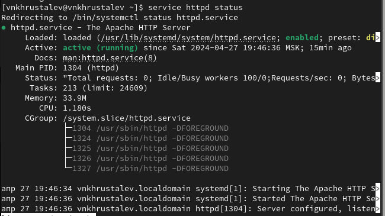{ #fig:002 width=70% }

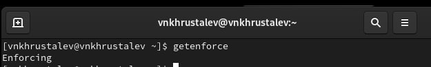{ #fig:001 width=70% }

2. Определение контекста безопасности и попытка проверки наличия команды StInfo. +sestatus команды не существтует. (рис. [-@fig:003] и [-@fig:004] и [-@fig:004])

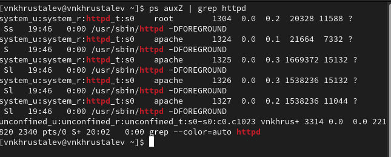{ #fig:003 width=70% }

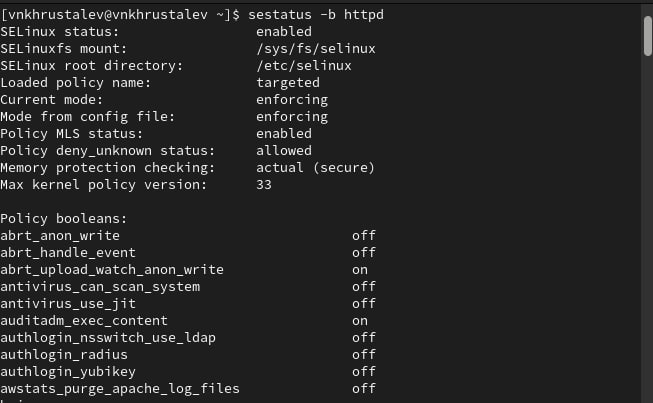{ #fig:004 width=70% }

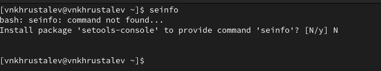{ #fig:005 width=70% }

3. Определение типов файлов в диреекториях Apache (файлов серервера) (рис. [-@fig:006] и [-@fig:007])

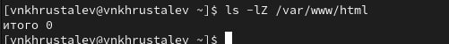{ #fig:006 width=70% }

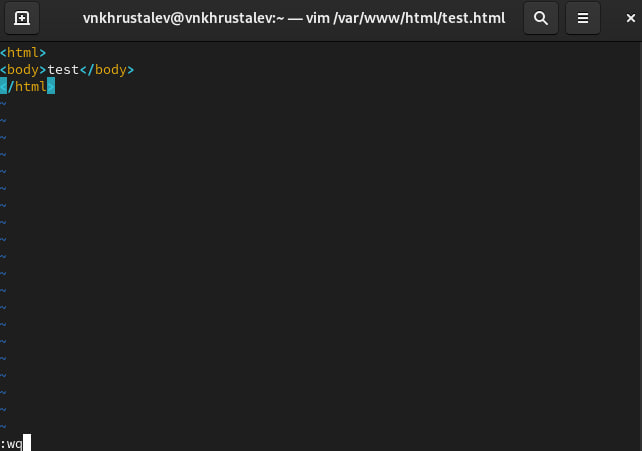{ #fig:007 width=70% }

4. Создание html файла, проверка его контекста и визуальный просмотр (рис. [-@fig:008] и [-@fig:009] и [-@fig:010])

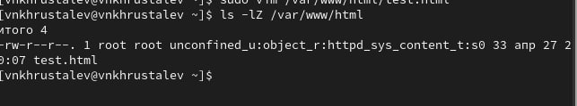{ #fig:008 width=70% }

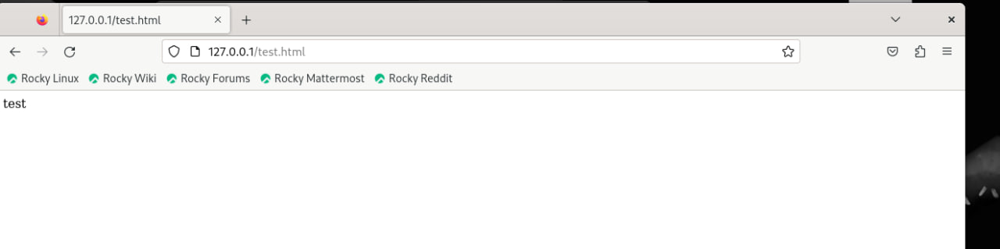{ #fig:009 width=70% }

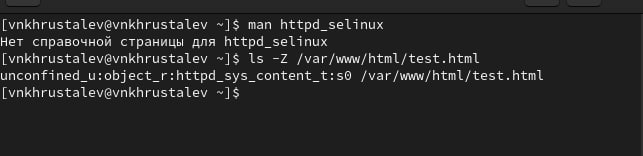{ #fig:010 width=70% }

5. Просмотр инфо о команде httpd_selinux -- она отсутвует (рис. [-@fig:011])

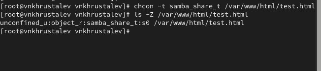{ #fig:011 width=70% }

6. Изменение конктекста html файла на любой другой и попытка просмотра. У нес нет доступа. Так же проверим логи. (рис. [-@fig:012] и [-@fig:013] и [-@fig:014])

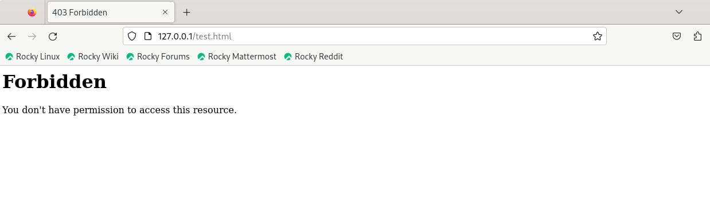{ #fig:012 width=70% }

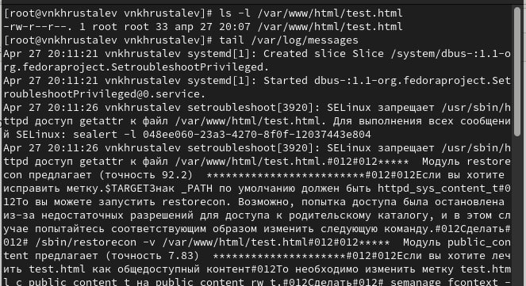{ #fig:013 width=70% }

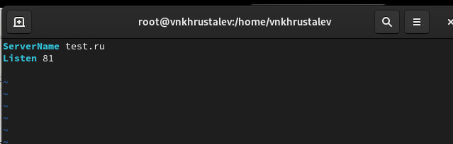{ #fig:014 width=70% }

7. Проведём доп изменения. Изменим прослушиваемый порт сервреа на 81 и перезапустим веб-сервер. Ошибок у нас нет, так как я ранее пользовался тут Apache и порт 81 прописал в разрешённые. Поэтому команда добавления в разрешённые тут была излишняя (рис. [-@fig:015] и [-@fig:016] и [-@fig:017])

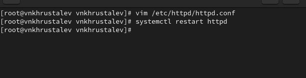{ #fig:015 width=70% }

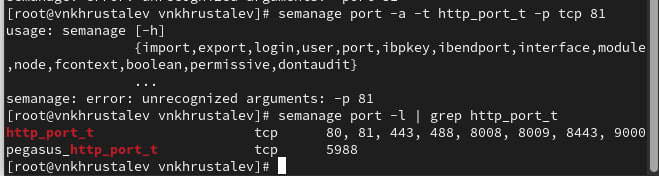{ #fig:016 width=70% }

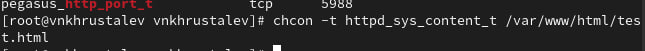{ #fig:017 width=70% }

8. Вернём всё обратно. Проверим что всё отображается. И попытаемся отключить порт 81, но не выйдет так как он уже используется и прописан в другом месте (рис. [-@fig:021] и [-@fig:018] и [-@fig:019] и [-@fig:020])

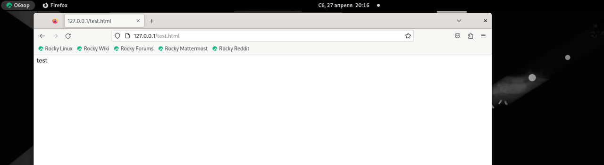{ #fig:018 width=70% }

{ #fig:021 width=70% }

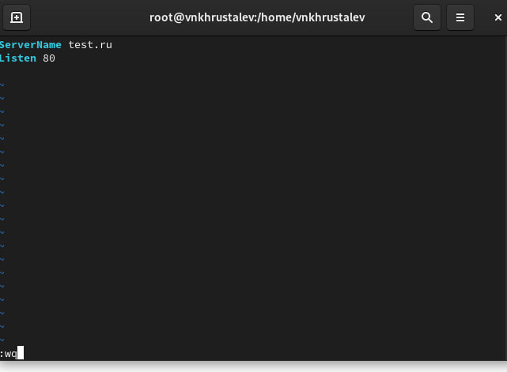{ #fig:019 width=70% }

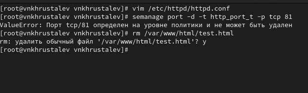{ #fig:020 width=70% }

# Выводы

На данной лабораторной работе мы развили навыки администрирования ОС Linux, получили первое практическое знакомство с технологией SELinux.