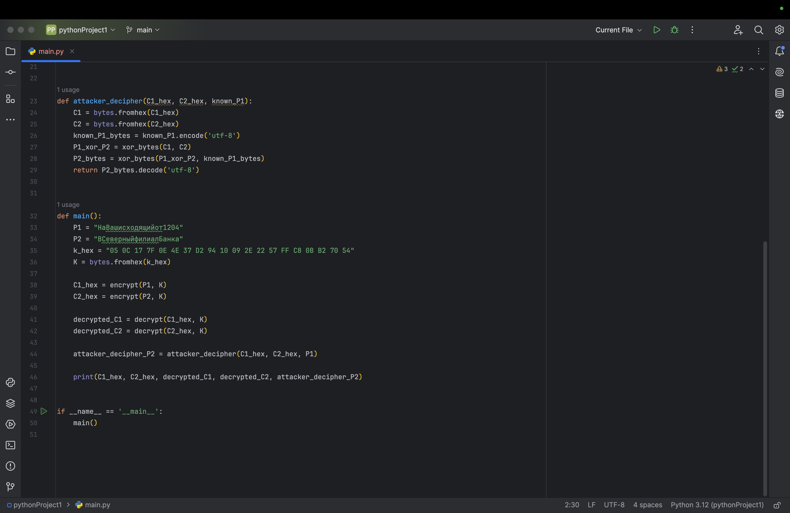

---
## Front matter
title: "Отчет по лабораторной работе 8"
subtitle: "Основы Инфомационной безопасности"
author: "Хрусталев Влад Николаевич"

## Generic otions
lang: ru-RU
toc-title: "Содержание"

## Bibliography
bibliography: bib/cite.bib
csl: pandoc/csl/gost-r-7-0-5-2008-numeric.csl

## Pdf output format
toc: true # Table of contents
toc-depth: 2
lof: true # List of figures
lot: true # List of tables
fontsize: 12pt
linestretch: 1.5
papersize: a4
documentclass: scrreprt
## I18n polyglossia
polyglossia-lang:
name: russian
options:
	- spelling=modern
	- babelshorthands=true
polyglossia-otherlangs:
name: english
## I18n babel
babel-lang: russian
babel-otherlangs: english
## Fonts
mainfont: PT Serif
romanfont: PT Serif
sansfont: PT Sans
monofont: PT Mono
mainfontoptions: Ligatures=TeX
romanfontoptions: Ligatures=TeX
sansfontoptions: Ligatures=TeX,Scale=MatchLowercase
monofontoptions: Scale=MatchLowercase,Scale=0.9
## Biblatex
biblatex: true
biblio-style: "gost-numeric"
biblatexoptions:
- parentracker=true
- backend=biber
- hyperref=auto
- language=auto
- autolang=other*
- citestyle=gost-numeric
## Pandoc-crossref LaTeX customization
figureTitle: "Рис."
tableTitle: "Таблица"
listingTitle: "Листинг"
lofTitle: "Список иллюстраций"
lotTitle: "Список таблиц"
lolTitle: "Листинги"
## Misc options
indent: true
header-includes:
- \usepackage{indentfirst}
- \usepackage{float} # keep figures where there are in the text
- \floatplacement{figure}{H} # keep figures where there are in the text
---

# Цель работы

Освоить на практике применение режима однократного гаммирования на примере кодирования различных исходных текстов одним ключом.

# Ход работы

## Выполение лабораторной

Нампишем программу эмулирующую задачу

```py
def xor_bytes(a, b):
return bytes(x ^ y for x, y in zip(a, b))


def extend_key(key, length):
return (key * (length // len(key) + 1))[:length]


def encrypt(plaintext, key):
plaintext_bytes = plaintext.encode('utf-8')
extended_key = extend_key(key, len(plaintext_bytes))
ciphertext = xor_bytes(plaintext_bytes, extended_key)
return ciphertext.hex()


def decrypt(ciphertext_hex, key):
ciphertext = bytes.fromhex(ciphertext_hex)
extended_key = extend_key(key, len(ciphertext))
plaintext_bytes = xor_bytes(ciphertext, extended_key)
return plaintext_bytes.decode('utf-8')


def attacker_decipher(C1_hex, C2_hex, known_P1):
C1 = bytes.fromhex(C1_hex)
C2 = bytes.fromhex(C2_hex)
known_P1_bytes = known_P1.encode('utf-8')
P1_xor_P2 = xor_bytes(C1, C2)
P2_bytes = xor_bytes(P1_xor_P2, known_P1_bytes)
return P2_bytes.decode('utf-8')


def main():
P1 = "НаВашисходящийот1204"
P2 = "ВСеверныйфилиалБанка"
k_hex = "05 0C 17 7F 0E 4E 37 D2 94 10 09 2E 22 57 FF C8 0B B2 70 54"
K = bytes.fromhex(k_hex)

C1_hex = encrypt(P1, K)
C2_hex = encrypt(P2, K)

decrypted_C1 = decrypt(C1_hex, K)
decrypted_C2 = decrypt(C2_hex, K)

attacker_decipher_P2 = attacker_decipher(C1_hex, C2_hex, P1)

print(C1_hex, C2_hex, decrypted_C1, decrypted_C2, attacker_decipher_P2)


if __name__ == '__main__':
main()
```

Выше сам код для болеьшей наглядности (рис. [-@fig:001] , рис. [-@fig:002])

{#fig:001 width=70%} 

{#fig:002 width=70%} 

Весь код не включая функции "attacker_decipher" эмулирует работу шифровальщика в одним ключём за счёт чего становится крайне не безопасным. Из-за свойств функции xor злоумышленик может расшифровать закодированные значения не зная ключи шифрования. Для этого ему надо пару Расшифрованное значение и Зашифрованное и другое сообщение которое хочет расшифровать. То есть нужно знать C1_hex C2_hex и P1_расшифрованный. 

Посмотрим на выввод программы с имитацией атаки (рис. [-@fig:003])

{#fig:003 width=70%} 

Как мы видим злоумышленик успешно смог расшифровать значение P2 при том что не узнавал ключ шифрования. Почему это так?


В режиме однократного гаммирования (one-time pad), если один ключ используется для шифрования двух разных сообщений, возникает уязвимость. Это происходит из-за свойства операции XOR.

Для двух шифротекстов (C1) и (C2), зашифрованных с использованием одного ключа (K):

C1 = P1 xor K

C2 = P2 xor K

Злоумышленник может вычислить:

C1 xor C2 = (P1 xor K) xor (P2 xor K)

Из свойства операции XOR:

(P1 xor K) xor (P2 xor K) = P1 xor P2

Таким образом, злоумышленник получает:

P1 xor P2 = C1 xor C2

Предположим, что злоумышленник знает текст (P1) (или его формат). Тогда он может использовать известный текст (P1) для вычисления (P2).

1.Злоумышленник вычисляет (C1 xor C2):

P1 xor P2 = C1 xor C2

2.Зная (P1), злоумышленник может вычислить (P2):

P2 = (C1 xor C2) xor P1

## Ответы на контрольные вопросы

1.Как, зная один из текстов (P1 или P2), определить другой, не зная при этом ключа?

Если злоумышленник знает один из текстов (P1) или (P2) и имеет доступ к шифротекстам (C1) и (C2), он может вычислить другой текст, используя следующее свойство XOR:

1.Вычислите (C1 xor C2):

P1 xor P2 = C1 xor C2

2.Используя известный текст (P1), вычислите (P2):

P2 = (C1 xor C2) xor P1

2.Что будет при повторном использовании ключа при шифровании текста?

При повторном использовании ключа для шифрования двух разных текстов возникает уязвимость, так как злоумышленник может вычислить XOR шифротекстов:

C1 xor C2 = P1 xor P2

Это позволяет злоумышленнику, зная один из открытых текстов, определить второй текст, не зная ключа.

3.Как реализуется режим шифрования однократного гаммирования одним ключом двух открытых текстов?

Режим однократного гаммирования с одним ключом для двух текстов реализуется следующим образом:

1.Задается ключ (K).

2.Каждый текст шифруется с использованием ключа K и операции XOR:

C1 = P1 xor K

C2 = P2 xor K

4.Перечислите недостатки шифрования одним ключом двух открытых текстов.

Недостатки шифрования одним ключом двух открытых текстов включают:

1.Уязвимость к атаке на основе известного текста: Если злоумышленник знает один из текстов, он может вычислить второй текст.

2.Повторное использование ключа: Приводит к уязвимости, позволяющей вычислить XOR двух текстов.

3.Отсутствие безопасности: Повторное использование ключа нарушает принцип безопасности однократного гаммирования.

4.Перечислите преимущества шифрования одним ключом двух открытых текстов.

Преимущества шифрования одним ключом двух открытых текстов включают:

1.Простота реализации: Легко реализовать с использованием операции XOR.

2.Эффективность: Быстрое шифрование и дешифрование, так как операция XOR выполняется быстро.

3.Минимальное использование ресурсов: Не требует сложных вычислений или большого объема памяти.

Однако эти преимущества применимы только в контексте простоты и эффективности реализации, и не гарантируют безопасности, если ключ используется более одного раза.

# Вывод

Используя этот метод, злоумышленник может прочитать оба текста, не зная ключа и не стремясь его определить. Достаточно иметь доступ к одному из шифротекстов и знать или предполагать формат одного из открытых текстов.

Этот подход демонстрирует уязвимость однократного гаммирования при повторном использовании ключа для шифрования разных сообщений.
