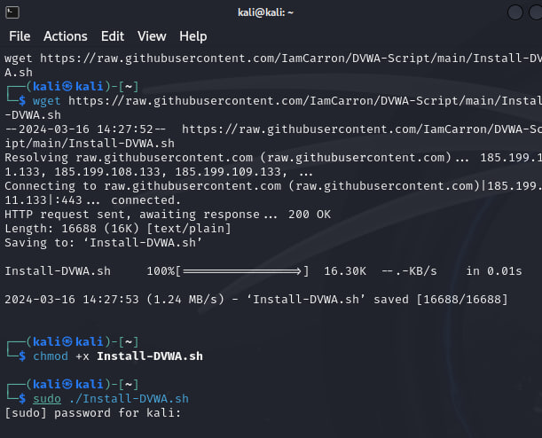
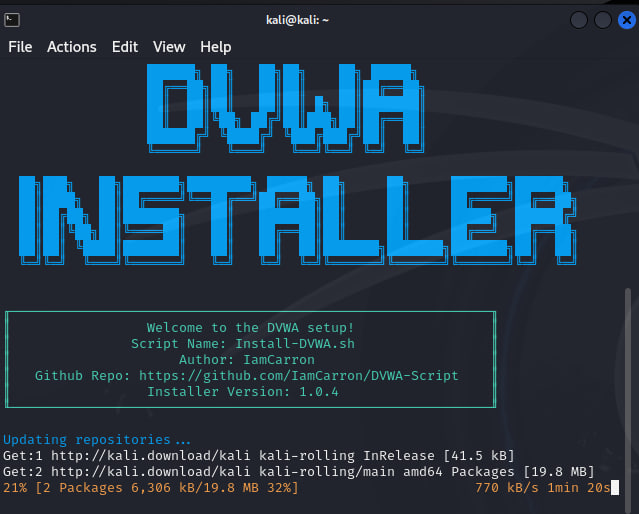
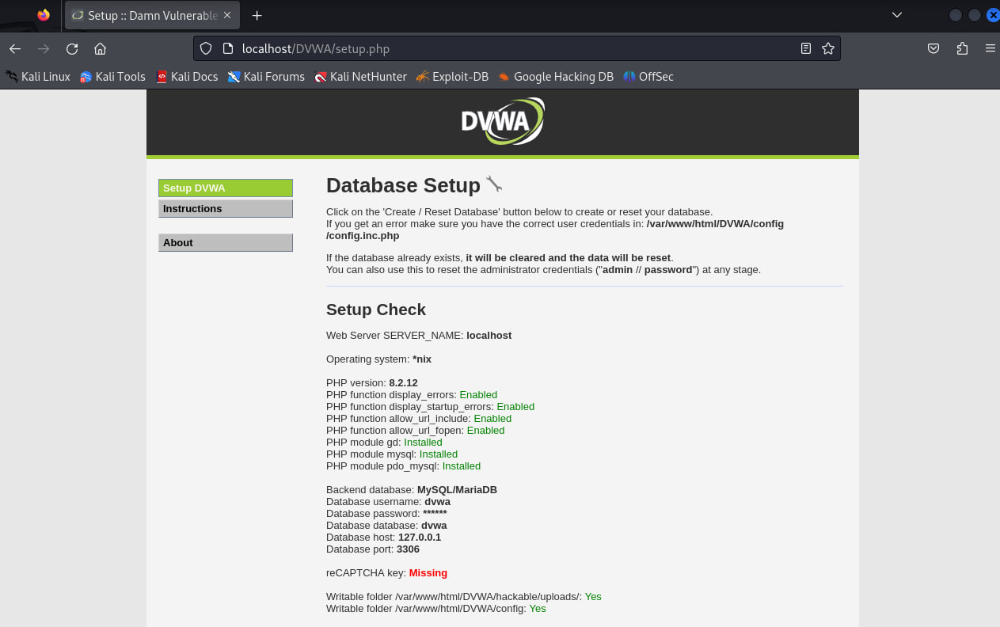

---
## Front matter
lang: ru-RU
title: Отчёт по ИП 2 этап. Установка DVWA
author: |
	 Хрусталев Влад

institute: |
	\inst{1}Российский Университет Дружбы Народов

date: 16 марта, 2023, Москва, Россия

## Formatting
mainfont: PT Serif
romanfont: PT Serif
sansfont: PT Sans
monofont: PT Mono
toc: false
slide_level: 2
theme: metropolis
header-includes: 
 - \metroset{progressbar=frametitle,sectionpage=progressbar,numbering=fraction}
 - '\makeatletter'
 - '\beamer@ignorenonframefalse'
 - '\makeatother'
aspectratio: 43
section-titles: true

---
# Вводная часть

## Цели и задачи

- Установить DVMA, изучить основные возможности

# Выполнение работы

## Скачиваем установщик командой: wget https://raw.githubusercontent.com/IamCarron/DVWA-Script/main/Install-DVWA.sh 
{#fig:001 width=70%}

##  Выдаём верные права: chmod +x Install-DVWA.sh
{#fig:001 width=70%}
## Запускаем устанощик и ждём заверещения..
{#fig:002 width=70%}

## После этого на локальном хосту через браузер мы можем посмотреть кго работу, протестировать функции.
{#fig:003 width=70%}
# Вывод

- В ходе выполения работы мы разобрались, что такое DVWA и для чего он служит.
