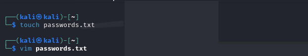
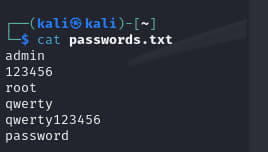
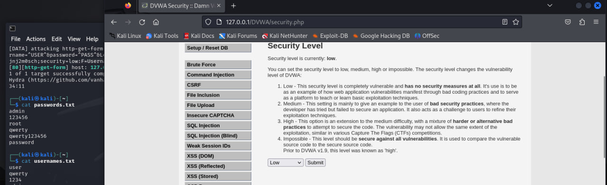
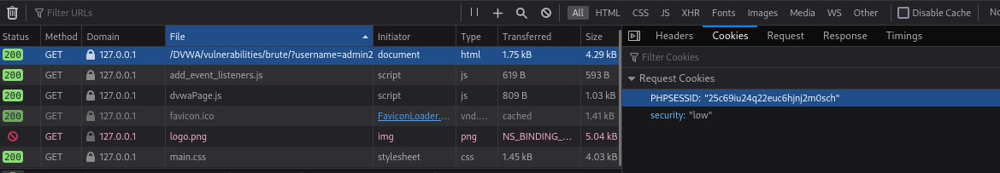
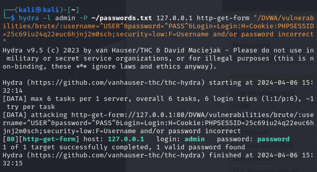
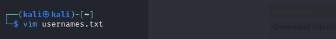
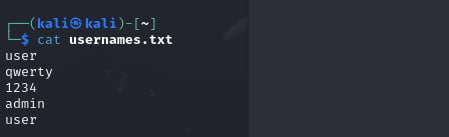
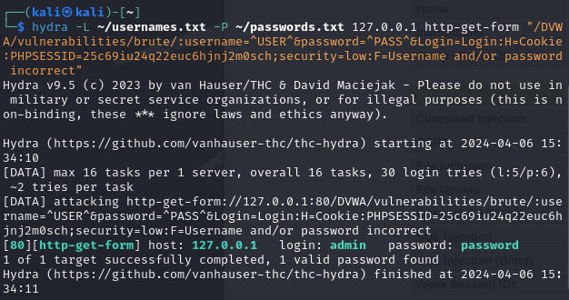

---
## Front matter
lang: ru-RU
title: Индивидуальный проект №3
subtitle: Основы информационной безопасности
author:
	Хрусталев Влад Николаевич
institute:
  - Российский университет дружбы народов им. Патриса Лумумбы, Москва, Россия

## i18n babel
babel-lang: russian
babel-otherlangs: english

## Formatting pdf
toc: false
toc-title: Содержание
slide_level: 2
aspectratio: 169
section-titles: true
theme: metropolis
header-includes:
 - \metroset{progressbar=frametitle,sectionpage=progressbar,numbering=fraction}
 - '\makeatletter'
 - '\beamer@ignorenonframefalse'
 - '\makeatother'

## Fonts
mainfont: Arial
romanfont: Arial
sansfont: Arial
monofont: Arial
---

## Цели и задачи

Освоение использования Hydra для перебора логинов и паролей.

# Выполнение лабораторной работы

## Создание файла passwords.txt для перебора паролей

{ #fig:001 width=70% }

## Содержание passwords.txt 

{ #fig:002 width=70% }

## Изменение настроек безопасности DVWA

{ #fig:003 width=70% }

## Просмотр URL и кук для тестирования брутфорса

{ #fig:004 width=70% }

## Запрос для перебора паролей из passwords.txt для логина admin. Найден логин и пароль: admin:password

{ #fig:005 width=70% }

## Создание файла usernames.txt для перебора логинов

{ #fig:006 width=70% }

## Содержание usernames.txt 

{ #fig:007 width=70% }

## Запрос для перебора паролей и логинов из файлов: passwords.txt и usernames.txt. Найден логин и пароль: admin:password

{ #fig:008 width=70% }

## Вывод

В результате выполнения лабораторной работы освоил использование Hydra для перебора логинов и паролей, отправляя соответствующие запросы.