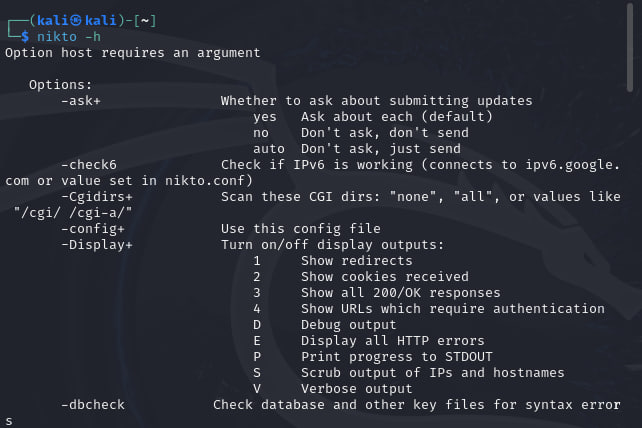
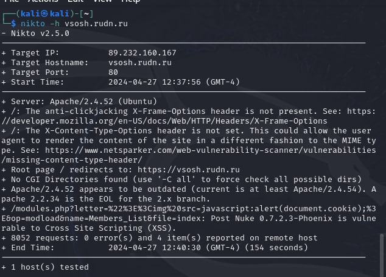
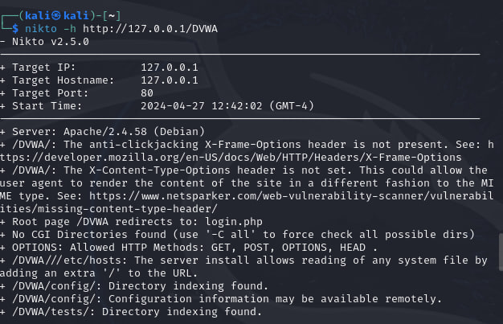

---
## Front matter
lang: ru-RU
title: Индивидуальный проект №4
subtitle: Основы информационной безопасности
author:
	Хрусталев Влад Николаевич
institute:
  - Российский университет дружбы народов им. Патриса Лумумбы, Москва, Россия

## i18n babel
babel-lang: russian
babel-otherlangs: english

## Formatting pdf
toc: false
toc-title: Содержание
slide_level: 2
aspectratio: 169
section-titles: true
theme: metropolis
header-includes:
 - \metroset{progressbar=frametitle,sectionpage=progressbar,numbering=fraction}
 - '\makeatletter'
 - '\beamer@ignorenonframefalse'
 - '\makeatother'

## Fonts
mainfont: Arial
romanfont: Arial
sansfont: Arial
monofont: Arial
---

## Цели и задачи

Знакомство с базовым сканером безопасности nikto.

# Выполнение лабораторной работы

## Посмотим основную информацию об данном ПО и посмотрим возможные аргументы для команды ``` nikto -h ```.

{ #fig:001 width=70% }

## Протестируем его на сайте моей разработки ``` nikto -h vsosh.rudn.ru```.

{ #fig:002 width=70% }

## Так же протестируем на поднятом уязвимом сервере ``` nikto -h 127.0.0.1/DVWA```.

{ #fig:003 width=70% }

## Вывод

В результате выполнения лабораторной работы на практике опробовали базовым сканером безопасности nikto.